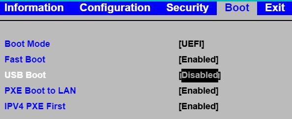
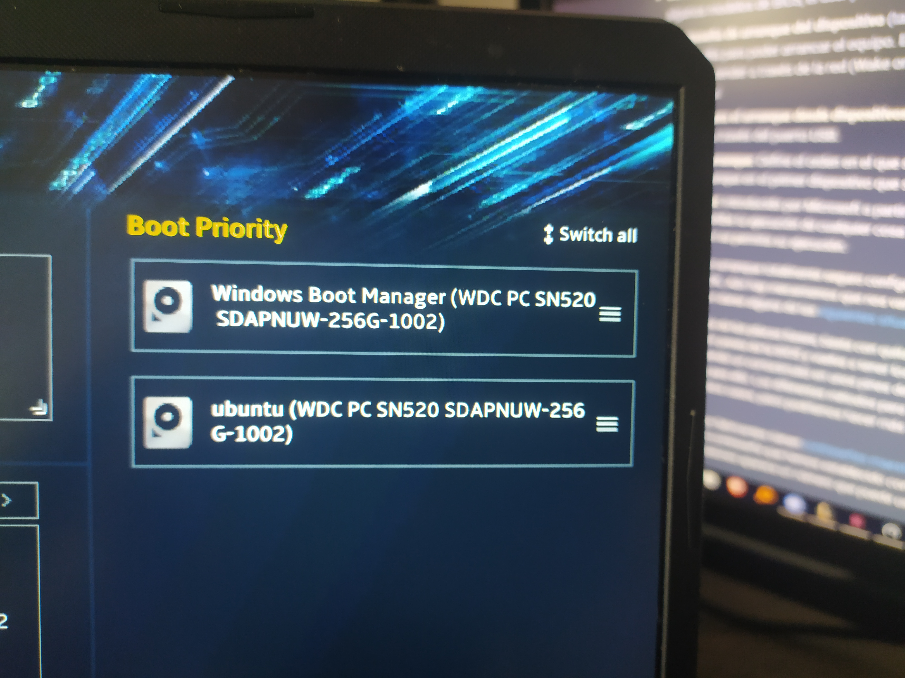

#Bastionado de la BIOS/UEFI
author: Jose
summary: Resumen del CodeLab
id: Parte1
categories: codelab,markdown
environments: Web
status: Published
feedback link: Un enlace en el que los usuarios puedan darte feedback (quizás creando un issue en un repositorio de git)
analytics account: ID de Google Analytics

## Explicacion
Duration: 0:5:00

###

Los parametros a configurar para que la BIOS/UEFI sean mas seguras son los mencionados en esta lista a continuacion:
* La contraseña de administración de la BIOS/UEFI
* La contraseña de usuario de la BIOS/UEFI
* Contraseña de arranque del dispositivo
* Permisos para arranque desde dispositivos USB
* Orden de arranque
* Secure Boot(Arranque seguro)
</ul>

## Contraseñas
Duration: 0:5:00

 <!--Las Almohadillas sirven para hacer salto de linea-->
### BIOS
A continuacion pongo una imagen mostrando la BIOS/UEFI de mi pórtatil la cual es un ASUS, para acceder a este menu he tenido que pulsar F2 mientras lo encendía.

##
### Contraseñas de Administrador y Usuario
La siguiente imagen es en el menu avanzado de la BIOS/UEFI a la cual se accede pulsando F7, aqui podemos habilitar tanto las contraseñas de administrador como las de usuario, solo cuando esta habilitada la contraseña de usuario se necesita utilizar esa contraseña para encender el ordenador. 

## Permisos de arranque
Duration: 0:5:00
### USB
Para este ajuste he tenido que utilizar otra BIOS/UEFI ya que la mía no tenía esta opción. Esta BIOS/UEFI es de un LENOVO. Cuando esta opción esta habilitada, se puede utilizar un USB para encender el ordenador con un sistema operativo que esta instalado en ese USB. Por lo tanto al deshabilitarlo ya no sera posible.

## Arranque
Duration: 0:5:00
### Orden de arranque(Boot Priority)
Esta opcion permite cuando se tiene varios sistemas operativos en el sistema o algun dispositivo conectado el elegir cual se iniciaria primero en cuanto se encienda el dispositivo, a continuación pongo un ejemplo en el cual tengo dos sistemas operativos, un Windows y un Ubuntu.

### Arranque seguro(Secure Boot)
El Arranque seguro es un sistema que impide la ejecucion de cualquier programa no certificado al encender el sistema. Para habilitarlo se tiene que ir a donde se va a mostrar a continuacion y se habilita.
